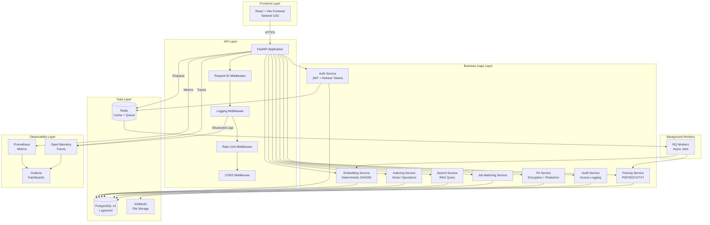
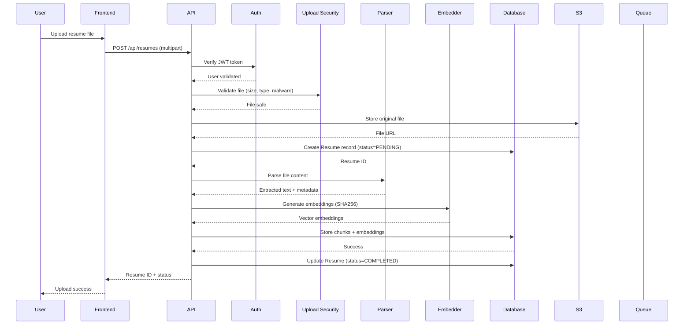
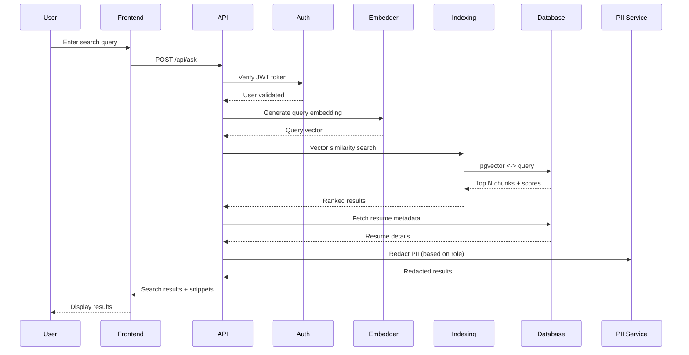
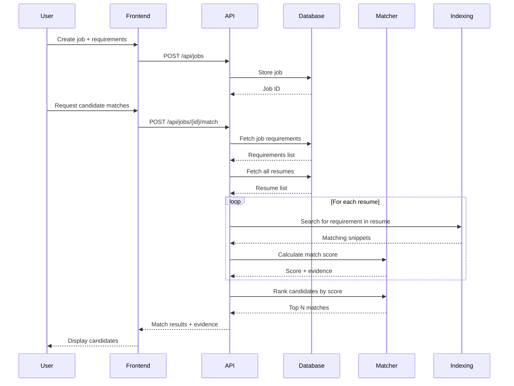
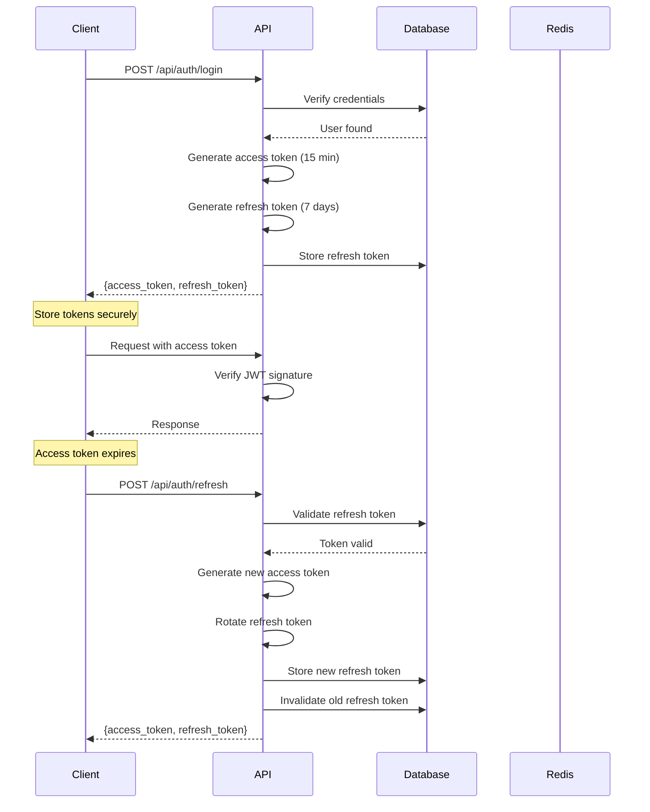
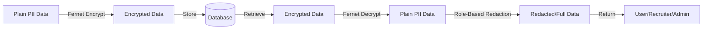
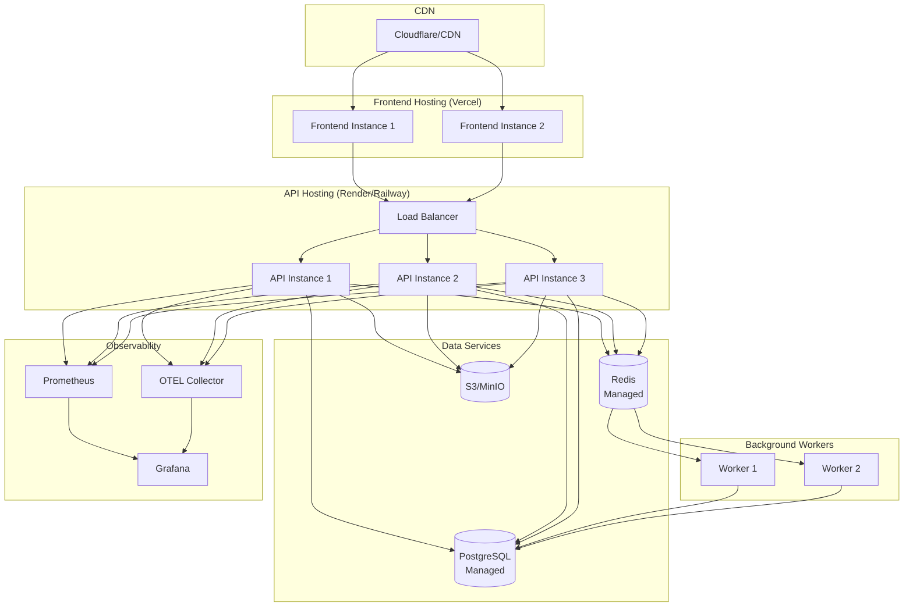
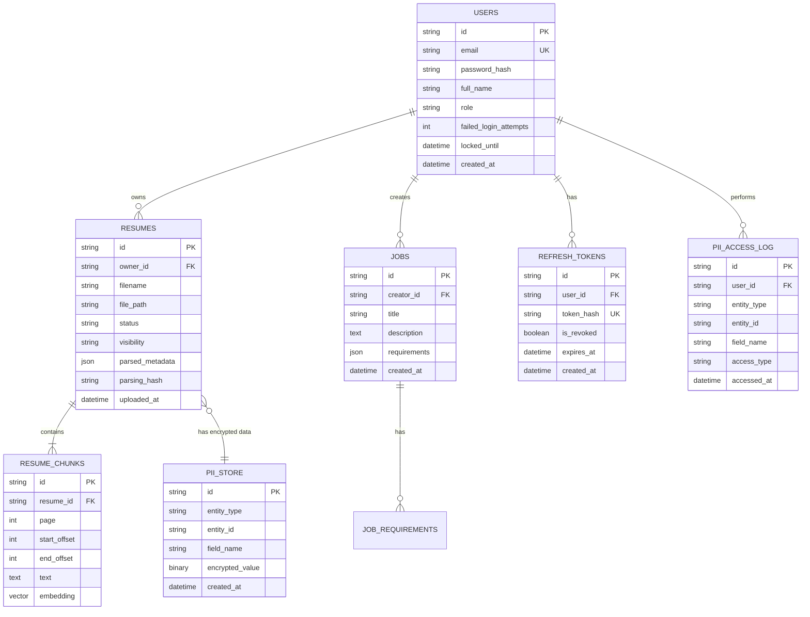

# ResumeRAG Architecture

## Overview

ResumeRAG is a production-grade RAG (Retrieval-Augmented Generation) system designed for semantic resume search and intelligent job-candidate matching. The architecture follows modern best practices with separation of concerns, scalability, security, and observability at its core.

## System Architecture

## Data Flow

### Resume Upload Flow

### Semantic Search Flow

### Job Matching Flow

## Component Details

### 1. Frontend (React + Vite)

**Purpose**: User interface for resume management and search

**Key Features**:
- Modern React 18 with hooks
- Vite for fast development and builds
- Tailwind CSS for responsive design
- Client-side routing (React Router)
- JWT token management
- File upload with progress
- Real-time search results

**Pages**:
- `/upload` - Resume upload interface
- `/search` - Semantic search with filters
- `/jobs` - Job creation and management
- `/candidate/:id` - Detailed candidate view

### 2. API Layer (FastAPI)

**Purpose**: RESTful API backend with business logic

**Middleware Stack** (execution order):
1. `CORSMiddleware` - Cross-origin resource sharing
2. `RequestIDMiddleware` - Generate/propagate request IDs
3. `StructuredLoggingMiddleware` - JSON logging with PII masking
4. `RateLimitMiddleware` - 60 requests/min/user

**Routers**:
- `/api/auth` - Authentication (register, login, refresh)
- `/api/resumes` - Resume CRUD operations
- `/api/ask` - Semantic search endpoint
- `/api/jobs` - Job management and matching
- `/api/admin` - Admin operations (PII logs, queue status)
- `/api/meta` - Health check and metadata

**Key Design Decisions**:
- **Idempotency**: All POST creates require `Idempotency-Key` header
- **Rate Limiting**: Redis-backed, per-user limits
- **Async/Await**: Full async support for I/O operations
- **Dependency Injection**: FastAPI's DI for database sessions
- **Exception Handling**: Global handlers with structured error responses

### 3. Services Layer

#### Authentication Service (`auth.py`)
- JWT access tokens (15 min expiry)
- Refresh tokens (7 day expiry, rotation on use)
- Password hashing (bcrypt)
- Account lockout (5 failed attempts = 15 min lockout)

#### Parsing Service (`parsing.py`)
- PDF extraction (pdfminer.six)
- DOCX extraction (python-docx)
- TXT support
- ZIP archive handling
- Metadata extraction (title, author, creation date)

#### Embedding Service (`embedding.py`)
- Deterministic SHA256-based embeddings
- 1536-dimensional vectors (OpenAI compatibility)
- Text chunking (800 chars, 200 overlap)
- Normalization to unit length

#### Indexing Service (`indexing.py`)
- Vector storage in PostgreSQL (pgvector)
- L2 distance similarity (`<->` operator)
- Bulk insert for chunks
- Efficient search with HNSW index

#### PII Service (`pii.py`)
- Fernet encryption (AES-128-CBC)
- Field-level encryption for sensitive data
- Role-based redaction (user/recruiter/admin)
- Regex-based PII detection (email, phone, SSN)

#### Auditing Service (`auditing.py`)
- PII access logging
- User action tracking
- Timestamp + IP + user context
- Queryable audit trail

### 4. Data Layer

#### PostgreSQL + pgvector

**Tables**:
- `users` - User accounts (email, password hash, role)
- `resumes` - Resume metadata (filename, status, owner)
- `resume_chunks` - Text chunks with embeddings (vector column)
- `jobs` - Job postings (title, description, requirements)
- `refresh_tokens` - JWT refresh token storage
- `pii_store` - Encrypted PII data
- `pii_access_log` - PII access audit trail
- `idempotency_keys` - Request deduplication
- `ask_cache` - Query result caching

**Indexes**:
- HNSW index on `resume_chunks.embedding` for fast vector search
- B-tree indexes on foreign keys and common query fields
- Unique constraints on email, idempotency keys

#### Redis

**Uses**:
- Rate limiting (sliding window counters)
- RQ job queue for background tasks
- Session storage (future use)
- Query result caching

### 5. Observability

#### Structured Logging
- JSON format logs
- Request ID propagation
- PII masking in log messages
- Log levels: INFO (requests), WARNING (4xx), ERROR (5xx)

#### Prometheus Metrics
- HTTP metrics: request count, duration, status codes
- Business metrics: uploads, searches, matches
- Queue metrics: pending, failed, processing
- Error metrics: by type (validation, auth, internal)

#### OpenTelemetry Tracing
- Automatic FastAPI instrumentation
- Manual spans for key operations
- OTLP exporter to collector
- Request context propagation

## Security Architecture

### Authentication Flow

### PII Encryption

**Encrypted Fields**:
- User email
- Resume metadata (name, contact info)
- Job descriptions (if containing PII)

**Encryption Key Management**:
- `FERNET_KEY` environment variable
- Must be 32 URL-safe base64-encoded bytes
- Recommended: AWS Secrets Manager / Azure Key Vault

## Scalability Considerations

### Horizontal Scaling

**API Tier**:
- Stateless design (no session state in memory)
- Multiple API instances behind load balancer
- Sticky sessions not required

**Worker Tier**:
- Multiple RQ workers can process queue concurrently
- Redis queue as coordination point
- Auto-scaling based on queue depth

**Database Tier**:
- PostgreSQL read replicas for search queries
- Write operations to primary
- Connection pooling (SQLAlchemy async)

### Performance Optimization

**Caching Strategy**:
- Query results cached in `ask_cache` table
- Idempotency responses cached for 24 hours
- Rate limit counters in Redis (fast in-memory)

**Database Optimization**:
- HNSW index for vector similarity (O(log n) search)
- Partial indexes on frequently filtered columns
- Bulk insert for resume chunks (one transaction)

**Async I/O**:
- All database operations use asyncpg
- Non-blocking request handling
- Uvicorn with multiple workers

## Deployment Architecture

### Production Environment

## Technology Decisions

### Why FastAPI?
- **Performance**: ASGI-based, async support, benchmarks comparable to Node.js
- **Developer Experience**: Auto-generated OpenAPI docs, type hints, dependency injection
- **Ecosystem**: Rich plugin ecosystem (SQLAlchemy, Alembic, Pydantic)

### Why PostgreSQL + pgvector?
- **Unified Storage**: Store structured data + vectors in one database
- **ACID Transactions**: Consistency guarantees for relational data
- **pgvector Extension**: Efficient vector similarity search with HNSW index
- **Maturity**: Battle-tested, rich tooling, managed services available

### Why Deterministic Embeddings (SHA256)?
- **Reproducibility**: Same text always produces same embedding
- **No API Costs**: No external calls to OpenAI/Cohere
- **Fast**: Hash computation is very fast (< 1ms)
- **Privacy**: All computation local, no data sent to third parties
- **Trade-off**: Lower semantic quality vs. transformer models, but sufficient for demo

### Why Redis for Queue?
- **In-Memory Performance**: Fast job enqueue/dequeue
- **RQ Integration**: Simple Python library, easy to use
- **Durability**: Optional persistence (RDB/AOF)
- **Monitoring**: Rich introspection tools

## Database Schema (ER Diagram)

## Future Architecture Enhancements

### Phase 4+ (Potential)

1. **GraphQL API** - For flexible client queries
2. **WebSocket Support** - Real-time search result updates
3. **Multi-Tenancy** - Organization-level isolation
4. **ML Model Integration** - Upgrade to transformer-based embeddings
5. **Full-Text Search** - PostgreSQL full-text for keyword search
6. **Recommendation Engine** - Job recommendations for candidates
7. **Analytics Dashboard** - Usage metrics and insights
8. **Mobile Apps** - React Native or Flutter clients

---

## References

- [FastAPI Documentation](https://fastapi.tiangolo.com/)
- [pgvector GitHub](https://github.com/pgvector/pgvector)
- [OpenTelemetry Python](https://opentelemetry.io/docs/instrumentation/python/)
- [Prometheus Best Practices](https://prometheus.io/docs/practices/)

---

_Last updated: October 4, 2025_
